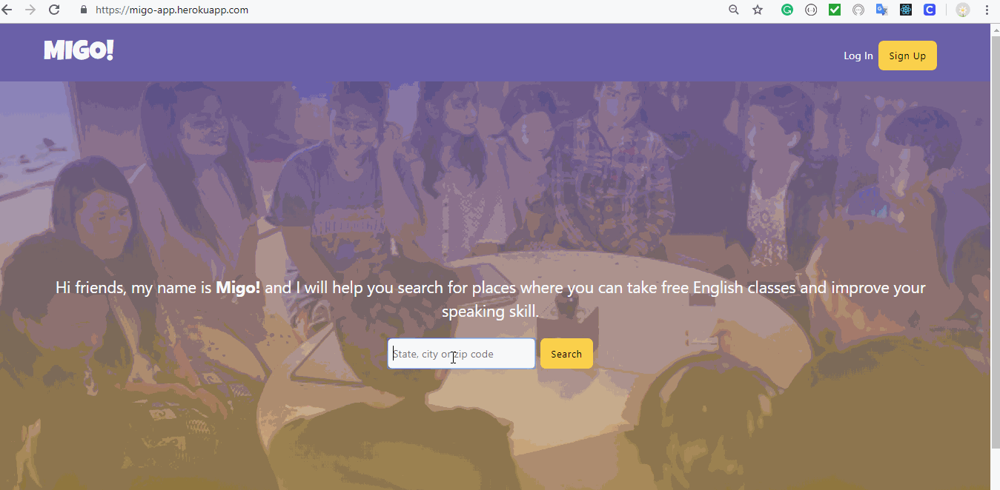

# MIGO!

When immigrants arrive to the United States, most of them only have money to pay their bills and food. However, most immigrants who do not speak English want to learn how to.

Many people may think that immigrants can find free English classes online like Dulingo, fluentu, etc. However, speaking is a skill that has to be developed through personal interaction.

MIGO! will help them find places where they can learn English for free.

For the Front-End, Migo was built using <a src="https://developer.mozilla.org/en-US/docs/Web/Guide/HTML/HTML5">HTML5</a>, <a src="https://developer.mozilla.org/en-US/docs/Web/CSS/CSS3">CSS</a>, and React Route.

For the Back-End, Migo was built using .NET and C#. Migo has an API which talks to Google API to fetch a longitude a latitude for an address, and Uber Map Library uses the longitude and latitude to display the address on the map.
